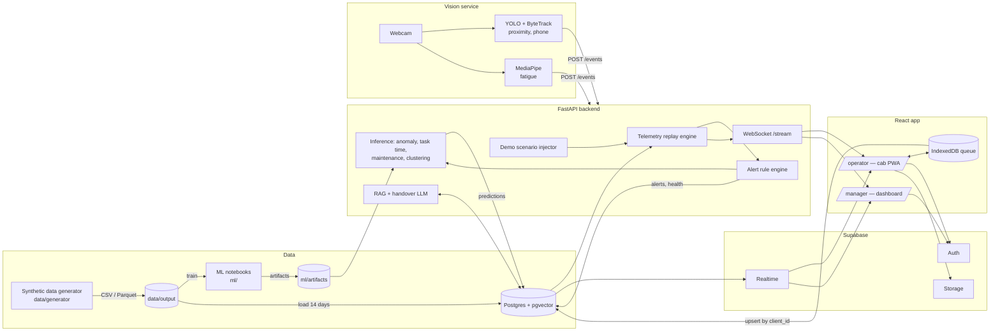

# Architecture

## Components

| Component | Folder | Responsibility |
|---|---|---|
| Generator | `data/generator/` | Produces all synthetic tables with hidden rules and ground truth |
| ML notebooks | `ml/` | Feature engineering, training, evaluation, export artifacts |
| FastAPI | `backend/` | Replay, rule engine, inference, LLM features, scenario triggers, WebSocket |
| Vision | `vision/` | Camera inference, posts events |
| Web | `web/` | Operator PWA and manager dashboard |
| Supabase | `supabase/` | Storage of record, auth, realtime push, files, vectors |

## Key flows

### Live telemetry and alerts
1. Replay engine reads telemetry rows for the selected machines in timestamp order.
2. Each row is pushed on `ws /stream/{machine_id}` (UI gauges update).
3. Rule engine evaluates the row; anomaly model runs on the rolling window every minute.
4. New or escalated alert → insert/update `alerts` → Realtime pushes it to operator and manager.
5. Health score computed → `machine_health_snapshots` (digital twin updates via Realtime).

Implementation (`backend/app/replay/`): telemetry is read, never written. Rules run inline on each
row; model 1 + health run in the threadpool at the first row of each data minute. One ordered
writer task does the DB writes, so an alert's insert (and its id) lands before its updates; the
`alert` WebSocket message is sent after the write. A demo scenario takes over one machine's stream
for its duration (recorded rows only refresh its template) and hands it back afterwards.

### Vision events
1. Vision service detects person at 2.4 m, rear sector, approaching.
2. `POST /events` with the event payload.
3. Backend writes `safety_events` + `alerts`, and also pushes on the machine's WebSocket for
   sub-second UI response (Realtime is the durable path; WebSocket is the fast path).

### Task estimates
1. Shift start (or plan change) → backend loads the shift's tasks + current weather + operator + health.
2. Task time model predicts p10/p50/p90 + SHAP factors → `tasks` updated.
3. Operator app reads tasks; Realtime pushes changes.

### Offline incident
1. Operator reports an incident offline → IndexedDB queue with `client_id`.
2. Back online → `upsert` on `incidents` by `client_id` → Realtime → manager feed.

### Chat
1. `POST /chat` with question → embed → `match_document_chunks` → LLM → answer + sources.
2. Stored in `chat_messages`.

## Demo speed
Replay supports `speed` = 1, 10 or 60 (minutes of data per real minute). The demo usually
runs at 1× for the live machine and uses scenario triggers for events.
