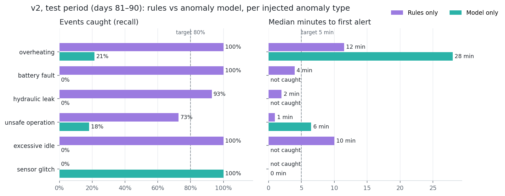

# Anomaly detection v2 — result sheet

The alert rule engine plus an anomaly model: one Isolation Forest per machine type × state
(idle / working), trained on 40 rolling-window telemetry features. Trained on days 1–70
(failure drift windows removed), tested once on days 81–90 against the 87 injected anomalies.
Notebook: `ml/01_anomaly.ipynb`.

**In plain words:** The shipped system (rules + model) catches 97% of test anomalies, with a
median delay of 2 minutes and about one false alert per 6 machine-hours. That is 8× fewer false
alerts than v1. The model's job is to tell a broken sensor from a broken machine: all 19 sensor
glitches were labelled correctly at once, where the rules would raise a false critical alarm.
On its own, the model now catches few real faults, so the rules do most of that work.

| Test, days 81–90 | Events caught | Median delay | False alerts / 100 machine-h |
|---|---|---|---|
| v1 rules + model | 100% | 2 min | 138 |
| **v2 rules + model (ships)** | **97%** ✓ (goal ≥ 90%) | **2 min** | **17.5** ✓ (goal ≤ 40) |
| v2 rules only | 74% | 6.5 min | 16.9 |
| v2 model only | 28% ✗ (§1 target ≥ 80%) | 0 min | 0.6 |

Per type, v2 rules + model (events caught / median delay): overheating 100% / 11.5 min ·
battery fault 100% / 4 min · hydraulic leak 93% / 2 min · excessive idle 100% / 10 min ·
sensor glitch 100% / 0 min · unsafe operation 82% / 1 min.

## What changed in v2 (one approved round)
1. **Separate models for idle and working minutes** (8 models instead of 4).
2. **Pitch, roll and ground speed added** as features (mean5 / std5 / slope15 each).
3. **Model alerts need 3 consecutive flagged minutes**, and flags in the first 5 minutes after an
   idle↔working switch (or a data gap) are ignored. Glitch detection stays instant.
4. **Two rules tightened** (variants compared on validation days only):
   - `HYD_PRESSURE_DROP` fired on normal pressure spikes and while travelling. Now it compares
     the 2-min mean with the 3-min mean ending 3 min earlier, and requires load > 40% for 6 min
     and a stationary machine. False alerts on validation fell from 79 to 14 per 100 h.
   - `EXCESS_IDLE` fired on any idle over 10 min. It now also needs a mean idle rpm above 1200.
     False alerts fell from 11 to 4 per 100 h, with recall unchanged.

## What is still weak
- **The 3 missed events:** 1 hydraulic leak, and 2 unsafe operations of the *harsh-lever*
  variant. All 8 tilt events are caught by `TIP_RISK`. v1 caught harsh-lever events only as a
  side effect of the loose pressure-drop rule that v2 tightened.
- **The model alone** fell from 62% to 28% recall. After the split, 97% of its flags on normal minutes fall in the
  first 5 minutes after a state switch, where the new gate discards them. So the 3% flag budget
  (contamination 0.03) is spent on transitions. On real faults it barely flags at all: 4% of
  battery-fault minutes and 8% of leak minutes. A sustained shift in one signal also stops
  looking unusual once its 5-min std and 15-min slope settle. A likely fix, not tried here
  (one-round limit), is to train each model only on settled minutes.

## Method notes
- **Split:** time-based, 70 / 10 / 10 days. Scalers and forests are fitted on training minutes
  outside every failure drift window. Drift windows are rebuilt in engine hours and match the
  `pre_failure_*` labels on 37,142 of 37,143 rows. Model settings are as in models.md §1.
- **Sensor glitch:** exactly one signal outside its sensor validity range (for example coolant
  0/150 °C, battery 0 V, or oil pressure 0 kPa while running), where that signal was plausible the
  minute before. The reading is replaced by the previous value before features are computed.
- **Metrics:** an event counts as caught if a correctly classified alert fires between its start
  and 5 minutes after its end. A false alert is a run of alerting minutes that touches no
  injected event. `pre_failure_*` labels are excluded (they belong to predictive maintenance).
  Minute-level precision/recall/F1 per type are in `metrics.json`, with v1's numbers under `v1_test`.
- `anomaly_label` / `anomaly_type` are never features. `score_anomaly()` gives the same score and
  kind as the batch pipeline (checked on 40 test minutes).
