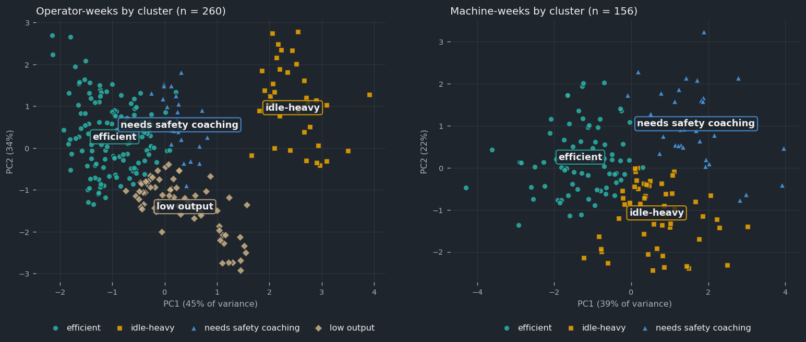

# Fleet clustering v2 — result sheet

Weekly operator and machine metrics (models.md §4), standardised within machine type, clustered with
StandardScaler + KMeans (k 3–5 by silhouette), named from the centroids, ranked by the efficiency index,
and screened for outliers (|z| > 2.5 or DBSCAN noise). Fitted on weeks 1–10 (days 1–70), holdout weeks
11–13 (days 71–90). Notebook: `ml/03_clustering.ipynb`. Inference: `ml/inference/clustering.py` →
`cluster_week(metrics_df)`, returning `fleet_metrics_weekly` rows.

**In plain words:** The operator clusters recover the hidden personalities with an adjusted Rand index of
**0.42 on unseen weeks** (0.45 on the fit weeks), and **0.41** when each
operator is placed by their average week. That is below the 0.5 bar. The models.md §4 version as written scored
0.36 / 0.37. One tuning round fixed two causes found without the labels (below).
On the fit weeks, aggressive → needs safety coaching 100%; novice → low output 100%; idler → idle-heavy 100%; efficient → efficient 98%; average → efficient 66%.
**Why the index stays below 0.5:** silhouette picks k = 4, so the two largest groups (efficient
25 %, average 40 %) share the "efficient" cluster. A perfect 4-cluster answer that merged only those two would score
0.58. The index punishes merging large groups hard, even when every other group is found cleanly.

| Operator clusters | ARI fit weeks (n=200) | ARI holdout weeks (n=60) | ARI per operator (average week, n=20) |
|---|---|---|---|
| v1 — models.md §4 as written | 0.370 | 0.363 | 0.415 |
| **v2 — ships** | **0.451** | **0.415** | **0.415** |

**Operators:** k = 4 (k=3: 0.331 · k=4: 0.371 · k=5: 0.344): 0 needs safety coaching, 1 efficient, 2 idle-heavy, 3 low output.
**Machines:** k = 3 (k=3: 0.208 · k=4: 0.176 · k=5: 0.168): 0 needs safety coaching, 1 idle-heavy, 2 efficient.

Holdout weeks, personality × cluster (operator-weeks):

| personality | 0: needs safety coaching | 1: efficient | 2: idle-heavy | 3: low output |
|---|---|---|---|---|
| aggressive | 6 | 0 | 0 | 0 |
| average | 0 | 13 | 0 | 11 |
| efficient | 0 | 14 | 0 | 1 |
| idler | 0 | 0 | 9 | 0 |
| novice | 0 | 0 | 0 | 6 |

## Why v1 missed 0.5, and the one tuning round
Reliability = ICC(1), the share of a feature's operator-week variance that lies between operators
(label-free, fit weeks):

| Feature | operator, v1 | operator, v2 | v2 operator weight √ICC | machine |
|---|---|---|---|---|
| fuel_per_productive_hour | 0.87 | 0.87 | 0.93 | 0.05 |
| idle_pct | 0.98 | 0.98 | 0.99 | 0.00 |
| productivity_per_hour | 0.79 | 0.79 | 0.89 | 0.58 |
| time_ratio | 0.14 | 0.72 | 0.85 | 0.21 |
| anomaly_per_10h | 0.07 | 0.07 | 0.27 | 0.00 |
| safety_per_10h | 0.26 | 0.26 | 0.51 | 0.00 |

1. **time_ratio against the planning p50 hides pace.** The task-time p50 already contains the operator's
   usual pace (`operator_avg_time_ratio`), so a slow operator gets a slow estimate and a ratio near 1. v2 divides by
   the **fleet p50** (same model, operator history unknown), i.e. what the job takes a typical operator in
   those conditions. The planning p50 in `tasks.predicted_p50_min` is unchanged.
2. **Noisy features set the cluster boundaries.** Anomaly and safety events are a handful per operator-week
   (127 detector fault events fleet-wide in 90 days), so they are mostly Poisson noise. StandardScaler gave
   them the same weight as idle time. v2 weights each operator feature by √ICC, so each contributes its
   between-operator variance. **Machines keep equal weights**: their reliabilities are ~0 because a machine's
   week mostly reflects who drove it, so machine clusters describe the week of use.

The personality labels were not used to choose either change. They were read only to score the result.
**What stays imperfect:** productivity per hour is stable per operator, but it tracks skill (experience
varies inside each personality), which is a real pattern the labels don't hold. Average operators fall
between efficient and slow: about two thirds of their weeks land in "efficient", the rest in "low output".
Machine-weeks stay in the machine's most common cluster 62% of the time (1/k = 33% if random).

## Efficiency index, ranking and outliers
`0.35·z(productivity) − 0.25·z(fuel/h) − 0.2·z(idle) − 0.2·z(time_ratio)` on the within-type z; rank 1 = best
in the site for that week and entity type. Mean operator index by personality: efficient +0.49, average +0.09, aggressive -0.09, idler -0.58, novice -0.79.
Outliers: 5% of operator-weeks, 15% of machine-weeks. DBSCAN eps from the k-distance
knee (1.02 operators, 1.87 machines; noise on the fit weeks 3% / 9%).
Each outlier row names its feature(s) in `outlier_reason`, e.g. M01 week of 2026-06-01: "Machine anomalies per 10 h 0.31 is far above normal for an excavator (typical 0.04, z +3.1)." / OP11 week of 2026-08-24: "Unusual combination this week: high fuel per productive hour (z +1.4) and low safety events per 10 h (z -0.8), unlike any usual pattern." These are for the manager to
verify (`verified_by`), not verdicts.

## Method notes
- Metrics per entity × week × machine type ("segment"): productive_hours = non-idle engine-on hours;
  fuel_per_productive_hour = all fuel ÷ productive hours; idle_pct = idle ÷ engine-on minutes;
  productivity_per_hour = completed quantity ÷ productive hours (m³, tons for haul); time_ratio = Σ actual ÷
  Σ fleet p50 over completed tasks; anomaly and safety events per 10 engine-on hours. Weeks start on the
  Monday of the shift date.
- Each segment is z-scored against its entity_type × machine_type mean / std on the fit weeks; an operator's
  week is the productive-hours-weighted mean of their per-type z. For operators the stored productivity mixes
  m³ and tons when they drove a truck that week (the z-scores don't).
- `anomaly_count` = `machine_fault` events of `ml.inference.anomaly` (sensor glitches excluded), never
  `anomaly_label`. `safety_event_count` leaves out `fatigue_high`: it follows the roster (night shifts), not
  operating behaviour; fatigue has its own path (models.md §5, §10).
- The task-time model trained on days 1–70, so time_ratio on the fit weeks uses in-sample p50s.
- Cluster names from the centroids: "needs safety coaching" (highest safety z ≥ 0.5), "idle-heavy" (highest
  idle z ≥ 0.5), "efficient" (lowest time_ratio + fuel), others after their strongest trait or "average".
  The training recommender (models.md §10) keys on "needs safety coaching".
- `personality` is read only in the evaluation cells.
- Artifacts: `model_operator.joblib` / `model_machine.joblib` (scaler, weights, KMeans, PCA, DBSCAN core points,
  eps; compress=3), `config.json` (type scalers, cluster names, weights), `feature_list.json`, `metrics.json`,
  `pca_scatter.png`, `pca_points.json` (dashboard scatter), `k_distance.png`, `fleet_metrics_weekly.csv` (all
  13 weeks, ready to load). They load only with the versions pinned in `ml/requirements.txt`. Not yet logged to
  `model_runs`; `metrics.json` has the fields that table needs.
