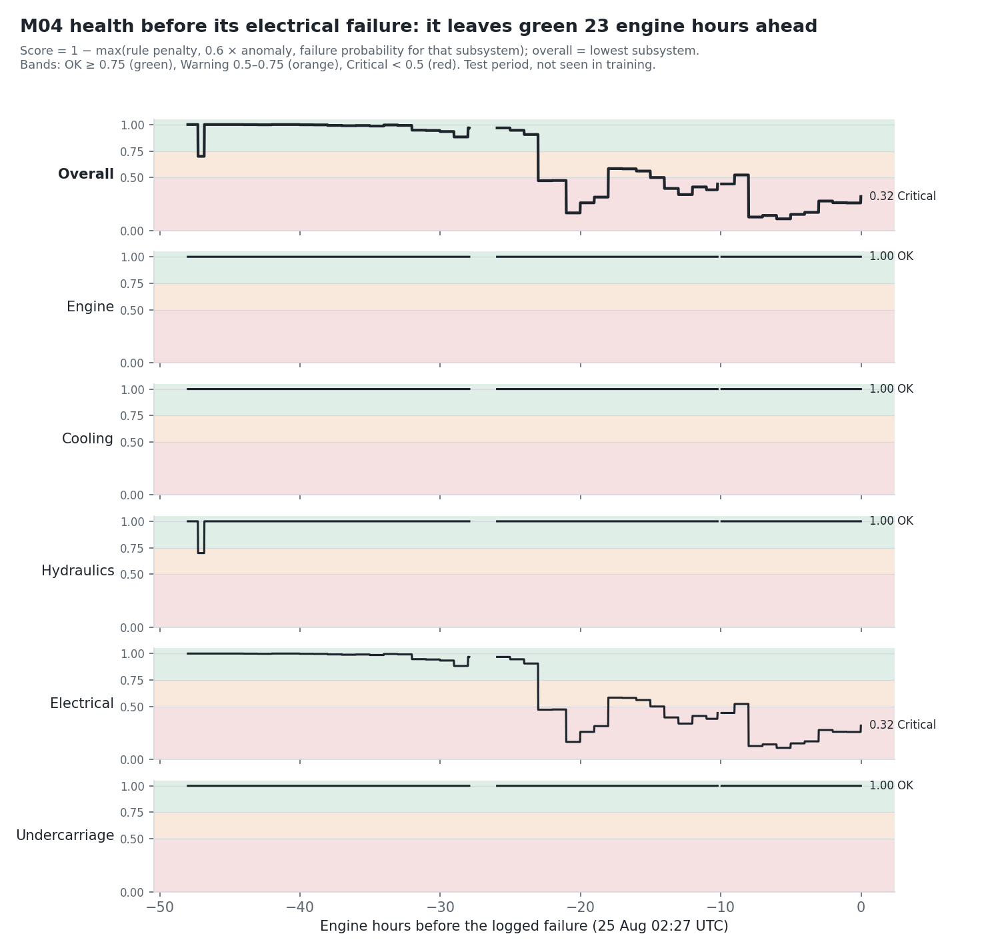

# Digital twin health score: demo sheet

Formula from models.md §11, no training. Notebook: `ml/05_health_and_plan.ipynb` (part 1). Inference:
`ml/inference/health.py` → `compute_health(machine_id, ts, rule_states, anomaly, maintenance, travelling)`,
which returns the `GET /machine/{machine_id}/health` response.

**In plain words:** Per subsystem, score = 1 − the worst of: rule alert (warning 0.3, critical 0.7),
0.6 × the anomaly score if the anomaly's top signals belong to that subsystem, and the failure probability
if the maintenance model names that subsystem. Overall = the lowest subsystem. On M04's electrical failure in
the test period (2026-08-25, not seen in training), the machine is green until **23 engine hours before the
failure**, then drops to red. Over the last 23 hours it moves between orange and red, and it ends at **0.32 Critical**.

## What the chart shows (last 48 engine hours, 2,745 telemetry minutes)
| Band | Minutes | First reached | Why |
|---|---|---|---|
| Green (OK, ≥ 0.75) | 1,353 | start of window | |
| Orange (Warning, 0.5–0.75) | 327 | −47.3 h | a short hydraulic leak event with fault code E-360 (hydraulics 0.7 for 27 min), unrelated to the failure |
| Red (Critical, < 0.5) | 1,065 | −23.0 h | failure probability for electrical jumps from 0.09 to 0.53 within one engine hour |

Electrical goes **straight from green to red** at −23 h. Its orange minutes come later, when the
probability dips back to 0.42–0.50. The step shape comes from the maintenance model, which updates once per engine hour.
Engine, cooling and undercarriage stay at 1.0. The component rule names electrical all through the window.

Why the window is 48 engine hours and not "the day before": M04 runs about 16 engine hours per calendar day,
and the maintenance model flags failures a median 37 engine hours ahead. By the calendar day before the failure,
the machine is already red.

## Decisions
- **The anomaly term counts only when model 1 reports `machine_fault`.** On M04, normal minutes score
  median 0.20 and p90 0.49 (0.6 × 0.49 = 0.29), so the literal formula would turn about 1 minute in 10 orange
  with nothing wrong. Sensor glitches don't count either (sensor fault, not machine fault).
- An anomaly hits **every** subsystem among its top 3 signals. Signal → subsystem follows §11. Derived features follow
  their signal (`rpm_per_load` → engine, `coolant_minus_hyd_oil_c` → cooling and hydraulics). Load, fuel, pitch, roll,
  speed and idle map to nothing. Vibration → undercarriage while travelling (> 2 km/h), else engine.
- Rule → subsystem: COOLANT_* cooling, HYD_OIL_HIGH / HYD_PRESSURE_DROP hydraulics, OIL_PRESSURE_LOW engine,
  BATTERY_LOW electrical, FAULT_CODE via the fault code table (E-110 cooling, E-215 engine, E-360/E-365 hydraulics,
  E-410 electrical, as `warning`). SEATBELT, TIP_RISK, EXCESS_IDLE, OVERSPEED and E-520 are about use, not health.
  Resolved alerts are skipped. `emergency` counts as critical.
- A `likely_component` outside the five subsystems (brakes, other) is reported but penalises nothing.
- **Missing inputs degrade gracefully:** a missing or malformed rule list, anomaly or prediction adds no
  penalty, and its output field is null. Nothing raises.
- Extra response fields (the backend's pydantic model ignores them): `band`, `subsystem_bands`, `reasons`
  (`{subsystem, source, penalty, text}`, largest first). `to_snapshot_row` maps to `machine_health_snapshots`.
- `rule_states_frame(telemetry)` is a **stateless** approximation of §R for notebooks and tests. It has no hysteresis,
  no graded stages and no HYD_PRESSURE_DROP, and runs on glitch-cleaned readings. The backend's rule engine replaces it live.

## Limits
- One failure shown. The health score is only as early as the maintenance model: electrical and undercarriage
  failures are the model's weak components (see `../maintenance/README.md`).
- The failure probability is an hourly value, so the twin changes in hourly steps between rule and anomaly events.
