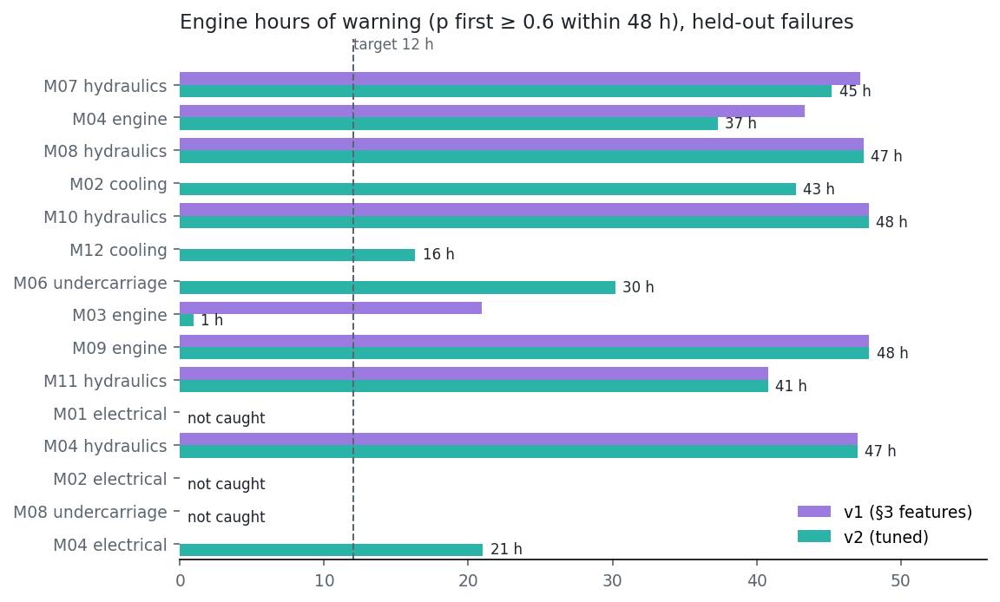
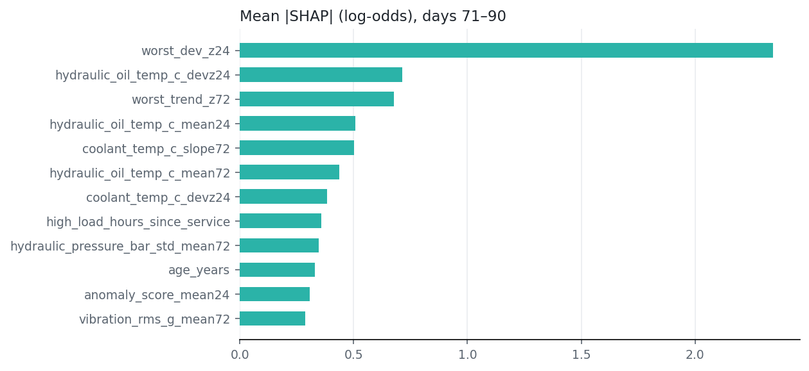

# Predictive maintenance v2: result sheet

XGBoost (models.md §3 parameters, `scale_pos_weight` = neg/pos) predicting a failure within the next
**48 engine hours**, one row per machine per engine hour. The likely component comes from the subsystem with
the worst signal. Notebook: `ml/04_predictive_maintenance.ipynb`. Inference: `ml/inference/maintenance.py` →
`predict_failure(features)`.

**In plain words (v2 + safety floor, what ships):** Across 15 held-out failures, the model warns before 12 of them, with a median
**37 engine hours** of warning (target 12 h ✓). It raises
0.16 false alarms per machine-week. **Hour-by-hour recall at 0.5 is 0.44, missing the 0.75
target ✗.** Once it catches a failure, it doesn't stay above 0.5 for all 48 hours:
it rises as the drift builds. Hydraulics and engine are reliable. Electrical and undercarriage are not yet.
With the safety floor, **15/15 failures reach at least medium risk**
(12/15 without it). The cost is more normal hours at medium or above
(2.4 % → 4.7 %), in 0.25 false medium alerts per
machine-week (runs merge, so the count doesn't rise).

## Why cross-validation, not the test split
Days 81–90 contain only **2 failures** (M08 undercarriage, M04 electrical), so the spec split can't
support a verdict. Main evaluation: **grouped, time-based, forward-chaining CV by failure**. Fold
boundaries fall on 2026-07-02, 2026-07-26, 2026-08-13, days with no open pre-failure window, so no failure's hours are
split. Each fold trains only on the past, and rows whose 48 h look-ahead reaches the block are purged.
Result: 3 folds and 15 held-out failures. The first 10 (June) are training-only.

| CV, 15 held-out failures | PR-AUC | Recall @0.5 (hours) | Failures caught @0.5 | Median lead (p ≥ 0.6) | False alarms / machine-week |
|---|---|---|---|---|---|
| Baseline rule (worst 72 h trend z, overdue service) | 0.25 | 0.01 | 1/15 | 0 h | 0.15 |
| XGBoost v1 (§3 features) | 0.57 | 0.42 | 9/15 | 21 h | 0.26 |
| XGBoost v2 (tuned) | 0.68 | 0.44 | 12/15 | 37 h | 0.16 |
| **XGBoost v2 + safety floor (ships)** | 0.69 | 0.44 | 12/15 | 37 h | 0.16 |

Positive-hour prevalence is 10 %, which is also the PR-AUC of a random score. Lead time is capped at 48 h, and a failure
that never crosses 0.6 counts as 0.

| Component (v1 → v2) | Failures | Recall @0.5 (hours) | Failures caught | Median lead | Component rule right |
|---|---|---|---|---|---|
| cooling | 2 | 0.00 → **0.29** | 0 → **2** | 0 → **30 h** | 78 % |
| electrical | 3 | 0.01 → **0.07** | 1 → **1** | 0 → **0 h** | 93 % |
| engine | 3 | 0.67 → **0.47** | 3 → **3** | 43 → **37 h** | 100 % |
| hydraulics | 5 | 0.84 → **0.85** | 5 → **5** | 47 → **47 h** | 100 % |
| undercarriage | 2 | 0.00 → **0.07** | 0 → **1** | 0 → **15 h** | 27 % |

Missed at 0.5 (v2): M01 electrical (max p 0.21), M02 electrical (max p 0.07), M08 undercarriage (max p 0.06). Engine hour-level recall falls in v2
(0.67 → 0.47, 3 failures, all still caught, but M03 only
1 h before): with few examples the trees now split on the cross-signal summaries.

## Safety floor (added after acceptance, not a tuning round)
Any signal ≥ 6 σ worse than the machine's own normal (24 h mean vs engine hours t−336…t−72) → probability at least
0.35 (medium), and `top_factors` names that signal first. The floor is below 0.5 and 0.6, so **recall at 0.5, lead time and false
alarms at 0.5 are unchanged by design** (table above). The medium band (p ≥ 0.3) shows the effect:

| CV, medium band (p ≥ 0.3) | Recall (hours) | Failures reaching medium | False medium alerts / machine-week | Normal hours at medium+ |
|---|---|---|---|---|
| v2 | 0.51 | 12/15 | 0.29 | 2.4 % |
| **v2 + floor** | 0.72 | 15/15 | 0.25 | 4.7 % |

Newly reaching medium with the floor: M01 electrical, M02 electrical, M08 undercarriage. Still below medium: none.

## Diagnosis before tuning (v1), and the one tuning round
v1 caught every hydraulics and engine failure and **no cooling or undercarriage failure, and 1 of 3
electrical**. The signal was there: before the missed electrical failures the battery's 24 h mean was about 25 σ below
that machine's normal level, and before the missed cooling failures coolant was 9–10 °C up. 94 % of positive hours
have drift² ≥ 0.25 (checked against `truth/failures.csv`, diagnosis only). The training folds hold 1–2 failures of
those components and **no undercarriage failure before August**. The trees split on absolute levels of
hydraulic oil temperature and on `machine_type` / `age_years`, which act as machine identity, and none of that
transfers. Undercarriage drift only acts while travelling, and on a wheel loader it doesn't move the 24 h vibration mean.
**Tuning round (parameters unchanged):** each signal's 24 h deviation from the machine's own baseline (engine hours
t−336…t−72) in training-std units; the worst deviation and worst 72 h trend across signals (component-agnostic);
vibration while travelling. Failures caught went from 9 to 12, and median lead
from 21 h to 37 h.

**What still misses and why:** electrical and undercarriage have 1–2 training examples per fold. The battery deviation is
now a feature, but the model still weighs it weakly. The fix is more failure history (or a rule floor, e.g. "any signal
≥ 6 σ worse than baseline → at least medium"). Not done: one tuning round only.

## Shipped model on the spec split (trained on days 1–70)
Test (days 81–90): PR-AUC 0.77, recall @0.5 0.28, 1/2 failures caught,
median lead 11 h, 0.00 false alarms / machine-week (2 failures: anecdotal).

## Method notes
- Hourly rows = engine-hour bins with telemetry. The prediction is made at the bin's last minute, and every window trails it.
  Engine hours are rebuilt from `shifts`, cut at `maintenance_log` failures and anchored to `machines.total_engine_hours`
  (matches the logged failure engine hours within 0.05 h).
- §3 features: 24/72 h mean and slope (per engine hour) of coolant, oil pressure, hydraulic oil temperature, hourly
  hydraulic pressure std, vibration and battery (sensor glitches replaced first). Anomaly count (model-1
  `machine_fault` events) and mean score over 24 h. Fault-code episodes over 24 h / 7 calendar days. Hours since service,
  service ratio, high-load (> 80 %) hours since service, machine type one-hot, age.
- Label from `maintenance_log` only. Hours between a failure and its repair are dropped, and so are the last 48 engine
  hours of each machine without a failure ahead (censored).
- Likely component = subsystem with the worst signed z (deviation or 72 h trend). Engine = oil pressure + vibration,
  cooling = coolant, hydraulics = oil temperature + pressure std, electrical = battery, undercarriage = travelling
  vibration beyond the overall vibration change. 86 % of held-out pre-failure hours right (93 % in the last 12 h).
- `top_factors` = XGBoost's exact TreeSHAP (`pred_contribs`, log-odds): the largest contributions pushing the probability up.
- Never read: `anomaly_label`, `anomaly_type`, `data/output/truth/` (except the one diagnosis cell above).
- Artifacts: `xgb_failure.joblib` (compress=3), `config.json` (z-scales, params), `feature_list.json`, `metrics.json`,
  `shap_importance.png`, `lead_time.png`. xgboost pinned in `ml/requirements.txt`. Not yet logged to `model_runs`.
