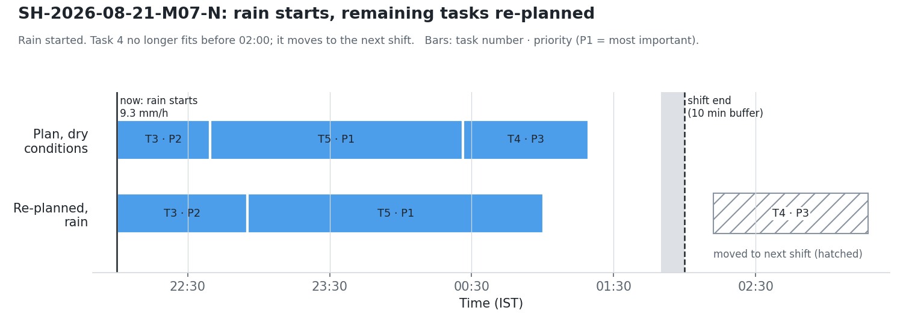

# Plan re-evaluation: demo sheet

models.md §12, no training: the task-time model (§2) plus a greedy scheduler. Notebook:
`ml/05_health_and_plan.ipynb` (part 2). Inference: `ml/inference/plan.py` → `detect_triggers(...)` and
`re_evaluate_plan(shift_id, tasks, now, shift_end, shift_start, conditions, reason)`, which returns the
`POST /plan/re-evaluate` response.

**In plain words:** When a trigger fires (a task past its p90, rain > 2 mm/h, overall health < 0.6, fatigue
high, or a manager edit), the remaining tasks are re-predicted under the conditions *now*. They are sorted by
priority (1 = most important), then by the shortest p50, and packed into the time left before shift end minus
a 10-minute buffer. What doesn't fit moves to the next shift, with a one-line explanation.

## The example: SH-2026-08-21-M07-N (test period)
At 22:00 IST, rain jumps from 0 to **9.3 mm/h** and visibility drops from 8,000 m to 3,900 m. Three tasks are left.
Task 3 is running.

| Task | Priority | p50 dry | p50 rain | Fits dry | Fits rain | Actual |
|---|---|---|---|---|---|---|
| 3 · load rock (running) | 2 | 74.6 | 90.3 | ✓ | ✓ | 72.9 min, completed |
| 5 · dig rock | 1 | 106.6 | 125.2 | ✓ | ✓ | 97.9 min, completed |
| 4 · load gravel | 3 | 53.3 | 65.5 | ✓ | ✗ → next shift | 61.9 min, completed |

Response: `fits` [3, 5], `moved_to_next_shift` [4], `new_order` [3, 5], explanation *"Rain started. Task 4 no
longer fits before 02:00; it moves to the next shift."*

**Honest note:** in the generated data all three tasks finished in time. The rain estimate (+19 to 23 %) was
pessimistic for tasks 3 and 5, which came in under even the dry p50s. Task 4 did take close to its rain estimate.
All three finished before shift end. The plan errs on the safe side here, but it is not
proof that the move was needed.

Across all 15 test-period shifts where rain starts mid-shift (≥ 1.5 h done, ≥ 3 h left, ≥ 3 tasks open), rain
changes the plan in **5** (each time one extra task moves). In 7, one task was already too much in dry
conditions, and 3 still fit with rain. The shift shown is the first of the 5.

## Decisions
- **Priority 1 = most important** (the schema only says 1–3; features.md says "highest priority first").
  A missing priority counts as 2, the schema default.
- **Greedy with skip:** a task that doesn't fit is skipped and the next one in the sort order is tried, so a
  short low-priority task can still fill the end of the shift. Fitting uses p50.
- **The running task stays first** and isn't re-ordered. Its time left = new p50 − minutes already run, at least
  5 min (a task past its p90 is still not done).
- **Current conditions:** weather columns and `health_score` in `conditions` replace each task's own values (a
  missing or NaN value keeps the task's value). `hours_into_shift` = now − shift start for every task, because start
  times depend on the order being decided.
- **Missing inputs degrade gracefully:** if the model can't run (missing columns or artifacts), the stored
  `predicted_p50_min` is used. A task with no estimate at all moves to the next shift, and the explanation says so.
  No tasks left gives empty lists and "No tasks left in this shift."
- `fits` keeps the original sequence order and `new_order` is the planned order (as in api_contract.md). Extra
  fields: `triggers`, `available_min`, `schedule` (per task: `start`, `end`, `p50_min`, `fits`, for the diff view).
- **Fatigue high → a 15-minute break** before the next task (after the running one). The break takes its time from the
  shift, then the remaining tasks are re-fitted. Explanation: *"Break added because fatigue is high (15 min before the
  next task). Task 5 no longer fits before 14:00; it moves to the next shift."* Response field `break` = `{start, end, minutes}`.
- Nothing is written. `POST /plan/accept` applies the result. Times in the explanation are Asia/Kolkata.

## Limits
- The task-time model has no live-fatigue input (only the operator's usual fatigue for that hour), so high
  fatigue changes the plan through the break, not through slower task estimates.
- The late-shift and night p50s are optimistic (models.md §2 survivorship), so late re-plans tend to fit a
  little more than will really finish.
- No precedence constraints yet. The OR-Tools CP-SAT version is the stretch goal.
