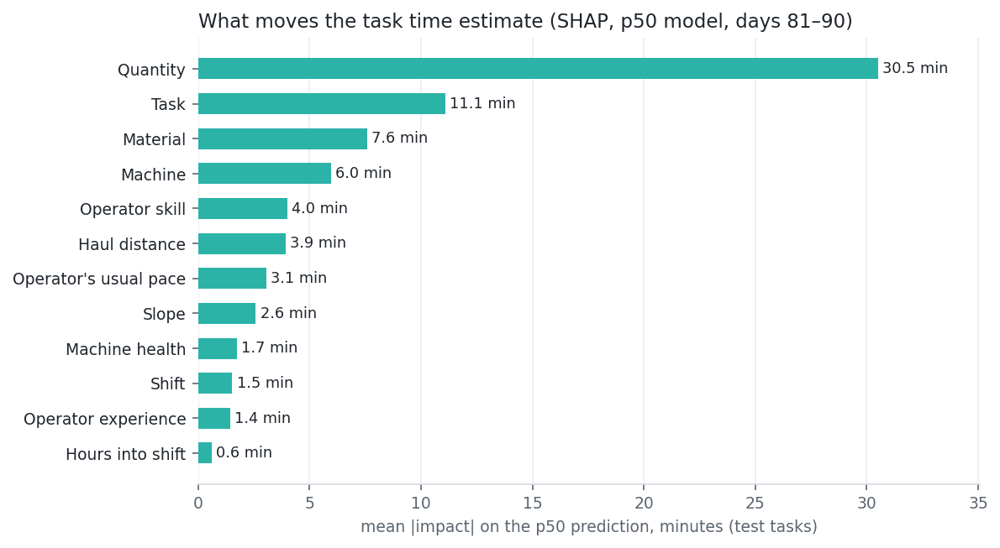

# Task time estimation v1 — result sheet

Three LightGBM quantile models (p10 / p50 / p90) on `log1p(actual_duration_min)`, with SHAP
factors in minutes. Trained on days 1–70 (4,946 completed tasks), early stopping and
interval calibration on days 71–80 (717), tested once on days 81–90 (716).
Notebook: `ml/02_task_time.ipynb`. Inference: `ml/inference/task_time.py` → `predict_task_time(df)`.

**In plain words:** The p50 estimate is off by 8.9 min on average (10.6 %),
against 23.8 min (28.4 %) for the simple "median minutes per unit × quantity"
rule. The p10–p90 range holds the real duration for 80% of test tasks (target ≈ 80 %)
after one calibration step. Without it the range was too narrow (66%). The
model recovered 4 of 6 planted factors from the generator's hidden formula (missed: night, hours into shift).

| Test, days 81–90 | MAE (min) | MAPE | p10–p90 coverage |
|---|---|---|---|
| Baseline (median min/unit per task_type × quantity) | 23.8 | 28.4 % | — |
| p50 model, raw intervals | 8.9 | 10.6 % | 65.5% ✗ |
| **p50 model, calibrated intervals (ships)** | **8.9** ✓ | **10.6 %** ✓ | **80.0%** |

Calibrated test intervals: 9.6% of tasks below p10, 10.3% above p90,
median width 33.8 min. The 40 test tasks with a random +15–60 min delay
(waiting for truck, blocked access, refuelling) are the main misses: MAPE 31 %, coverage
10%. Nothing in the features can predict them. On the other tasks MAPE is 9.4 %, coverage 84%.

## Why the raw intervals were too narrow, and the one tuning round
Raw coverage was 83% on train but 67%
on validation and 66% on test, with misses on both sides (18% below p10,
16% above p90). The quantile models learn the spread of the training residuals. On new
days the p50 error is larger: the operator's hidden pace is only partly known from past tasks, and the
failure-drift part of machine health is not in the logs. The random delays don't explain it.
**Fix (conformalized quantile regression):** the model parameters are unchanged. The conformity score
`max(p10 − y, y − p90)` on validation gives a log-space offset c = 0.052, so p10 is divided
and p90 multiplied by ×1.053. Test was not used to choose c.

## Planted factors (counterfactual on every test task, median p50 ratio)
| Change | Planted | Recovered | Pass (direction, ±50 % of log effect) |
|---|---|---|---|
| Rain 0 → 10 mm | ×1.150 | ×1.072 | ✗ |
| Rain 0 → 10 mm (+ visibility 8000 → 2750 m) | ×1.150 | ×1.113 | ✓ |
| Material clay → rock | ×1.400 | ×1.287 | ✓ |
| Material clay → sand | ×0.900 | ×0.927 | ✓ |
| Slope 0 → 8° | ×1.160 | ×1.112 | ✓ |
| Skill 0.9 → 0.45 (skill only) | ×1.281 | ×1.185 | ✓ |
| Skill 0.9 → 0.45 (+ usual pace) | ×1.281 | ×1.245 | ✓ |
| Day → night shift | ×1.100 | ×1.048 | ✗ |
| Day → night shift (+ usual fatigue) | ×1.100 | ×1.040 | ✗ |
| Hours into shift 3 → 7.5 | ×1.030 | ×0.936 | ✗ |

Mean |SHAP impact| on test (min): Quantity 30.5, Task 11.1, Material 7.6, Machine 6.0, Operator skill 4.0, Haul distance 3.9.

**Hours into shift and night are not recovered, because of survivorship in the data.** A task still running at
shift end is `delayed` with no duration, so it can't be a target: 37 % of tasks starting in hour 6–7 and 82 % of
those starting after hour 7, and 11.4 % of night-shift tasks vs 8.0 % of day-shift tasks. The ones that are lost
are the long ones (median completed duration 31 min after hour 7 vs ~85 min early). So the model learns "late
tasks are short" (×0.94 instead of ×1.03), and sees the night effect at about half
strength (right direction). **Late-shift and night p50s are optimistic.** Fixing this needs censored-duration training
(delayed tasks as "at least this long"), which is out of scope for v1.
Rain, material, slope and skill have the right sign and 69%–88% of the planted size (log terms). Rain on its own looks weak because
heavy rain (≥ 10 mm) is rare (0.5 % of hours) and visibility drops exactly when rain > 5 mm, so the model credits
both. Moving them together recovers ×1.11 of ×1.15.

## Method notes
- Features as in models.md §2, plus `operator_fatigue_hour_avg` (operator's mean fatigue score
  in that hour of shift over earlier shifts). `operator_avg_time_ratio` = mean actual ÷ reference
  over the operator's same-type tasks that ended before this task's scheduled start, last 30 days
  (brute-force checked on 300 tasks, no leakage).
- `health_score` is the service-based health rebuilt from `maintenance_log`. The live backend passes
  the `health_score` from `v_machine_health_latest`.
- Targets: `completed` tasks with a duration. `delayed` tasks in this data have no duration (still
  running at shift end), so they drop out. Completed tasks with a random delay are kept.
- `personality` and `data/output/truth/` are never read. Categoricals use the training levels
  (`encoders.json`); an unseen level becomes NaN.
- Reference minutes = median minutes per unit per task_type on train, with haul measured in ton-km
  (haul time scales with distance). The evaluation baseline stays literal (per unit, no distance).
- Output: `operator_avg_min` = usual pace × reference minutes for the task (null without history);
  `expected_efficiency` = p50 ÷ operator_avg_min (< 1 = faster than their usual). Factors exclude
  `quantity`/`unit` (size of the job). Each factor carries `feature`, `label` and `impact_min`.
- Artifacts: `lgbm_p10/p50/p90.joblib` (compress=3), `encoders.json`, `config.json`
  (interval offset), `feature_list.json`, `metrics.json`. They load only with the versions pinned in
  `ml/requirements.txt`. Not yet logged to `model_runs`; `metrics.json` has the fields that table needs.
